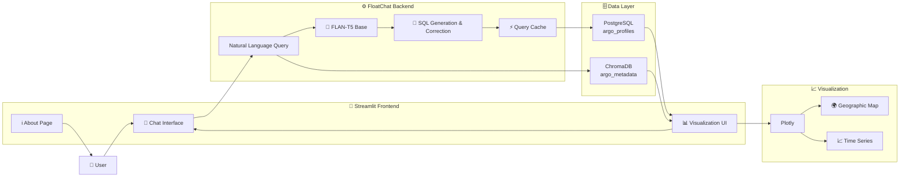
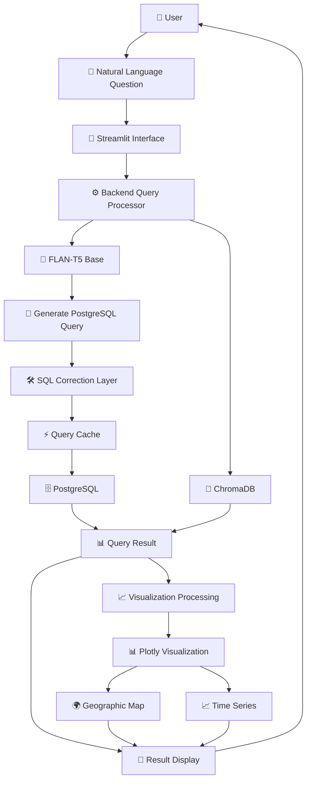
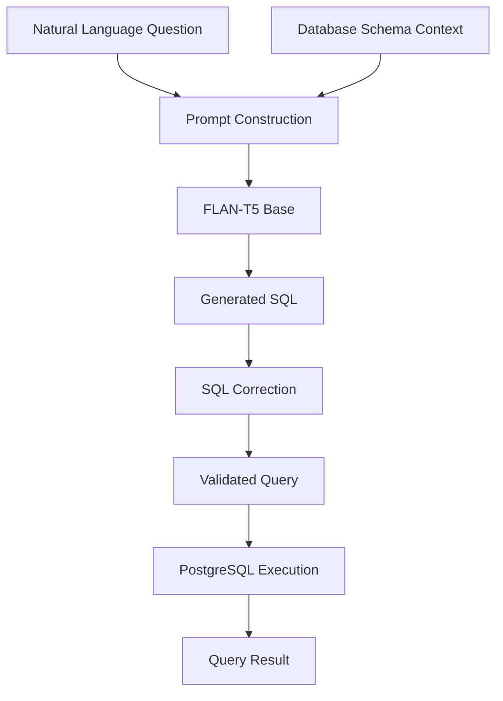
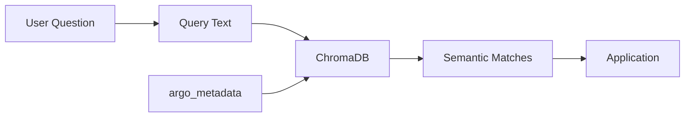
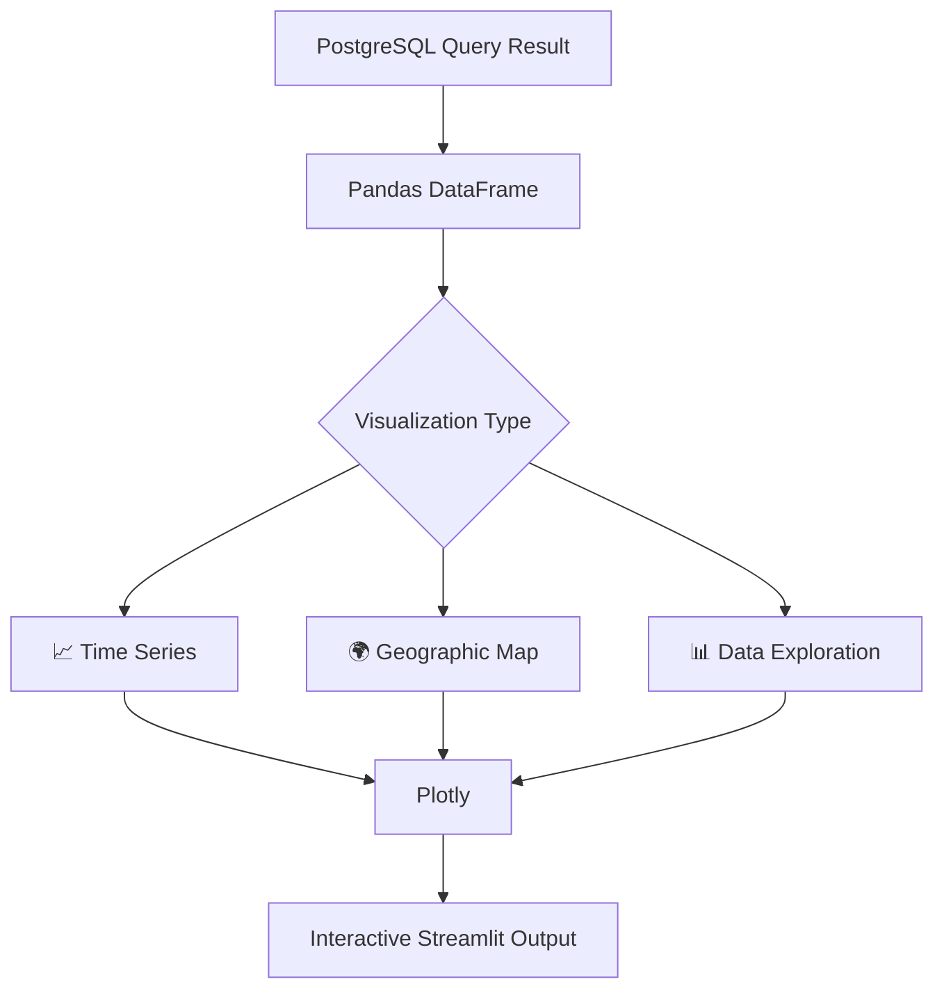
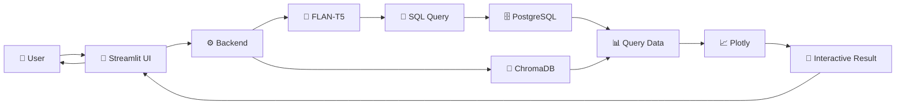
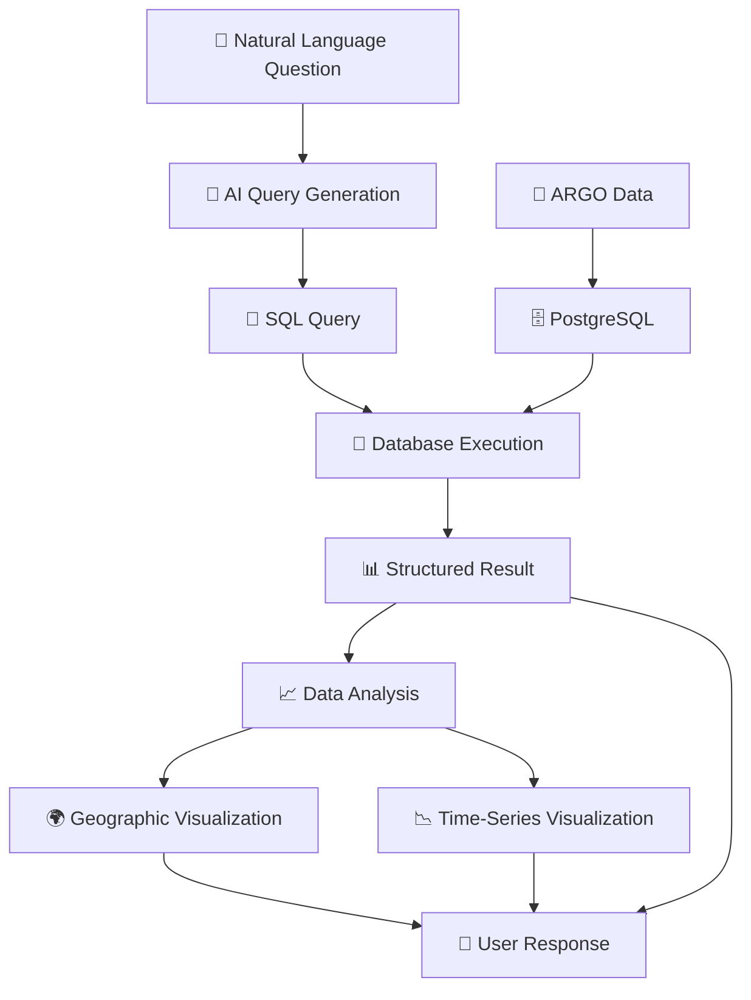
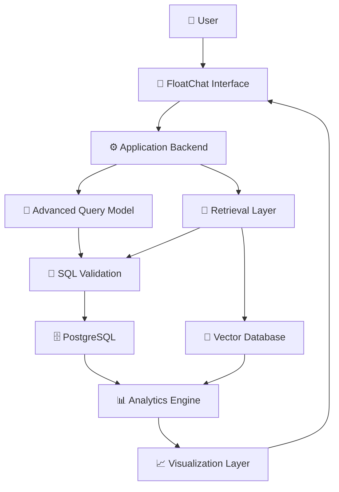

# 🌊 FloatChat — AI-Powered ARGO Ocean Data Explorer

<p align="center">
  <b>Natural Language • AI Querying • ARGO Ocean Data • Interactive Visualization</b>
</p>

<p align="center">
  An AI-powered conversational interface for exploring and visualizing ARGO float oceanographic data using natural language.
</p>

<p align="center">


</p>

---

## 🌊 Overview

**FloatChat** is an AI-powered conversational data exploration application designed to make **ARGO oceanographic data easier to query, analyze, and understand**.

Instead of requiring users to manually write SQL queries or navigate complex oceanographic datasets, FloatChat provides a conversational interface where users can ask questions about ARGO data using natural language.

The application combines:

- 🤖 Local language-model based query interpretation
- 🗄️ PostgreSQL for structured ARGO data
- 🧠 ChromaDB for semantic/vector-based retrieval
- 💬 Streamlit conversational interface
- 📊 Interactive Plotly visualizations
- 🌍 Geographic visualization of ARGO float locations
- 📈 Oceanographic parameter analysis
- ⚡ Query caching for repeated requests
- 🧩 Modular backend and visualization components

The project was developed as a **hackathon-oriented proof of concept** for conversational exploration of ARGO oceanographic data.

---

# 🎯 Problem Statement

Oceanographic datasets can contain large amounts of structured information that can be difficult to explore without technical knowledge.

Users may want to ask questions such as:

> "Show the average salinity near the equator."

or:

> "Show me the ARGO floats in the Indian Ocean."

Traditional database systems require users to understand:

- Database schemas
- SQL syntax
- Column names
- Geographic filtering
- Date and time formats
- Data visualization tools

This creates a barrier for researchers, students, and other users who want to explore ocean data without writing database queries manually.

---

# 💡 Proposed Solution

FloatChat introduces a conversational interface between the user and the ARGO dataset.

The user enters a natural-language question, and the application processes the request through an AI-assisted data querying pipeline.

The system then:

1. Receives the user's natural-language question.
2. Sends the question to the local language model.
3. Uses the model to generate a PostgreSQL query.
4. Applies known SQL corrections and formatting fixes.
5. Executes the generated query against PostgreSQL.
6. Performs semantic retrieval through ChromaDB when required.
7. Processes the returned data.
8. Generates interactive visualizations when applicable.
9. Displays the result through the Streamlit interface.

This creates a workflow where users can interact with oceanographic data through natural language instead of directly writing SQL.

---

# ✨ Key Features

## 💬 Conversational Interface

FloatChat provides a chatbot-style interface designed around natural-language interaction.

Features include:

- Chat-style user and AI messages
- Session-based conversation history
- Floating input interface
- AI processing indicator
- Automatic scrolling
- Dedicated Chat page
- Dedicated About page
- Ocean-themed user interface

---

## 🤖 AI-Assisted Query Processing

The backend uses a local **FLAN-T5 Base** model through Hugging Face Transformers.

The model is prompted with information about the available ARGO database structure and is used to transform natural-language questions into PostgreSQL queries.

### Example

```text
User:
Show average salinity near the equator in March 2025

FloatChat:
SELECT AVG(salinity)
FROM argo_profiles
WHERE ...
```

The generated query is then processed before being executed against the database.

---

## 🧠 Semantic Retrieval with ChromaDB

FloatChat also integrates **ChromaDB** for vector-based semantic retrieval.

ARGO metadata is stored in a ChromaDB collection named:

```text
argo_metadata
```

This allows the application to perform semantic searches over metadata rather than relying exclusively on exact keyword matching.

If the ChromaDB collection is empty, the application can initialize it with sample metadata documents.

---

## 🗄️ PostgreSQL Data Querying

PostgreSQL is used as the structured database layer.

The backend interacts with the ARGO data through the `argo_profiles` table.

The AI query-generation prompt contains knowledge about the available database columns so that natural-language questions can be translated into SQL queries.

The backend also performs corrections for known:

- Column-name issues
- Date-format issues
- SQL formatting problems

---

## 📊 Interactive Data Visualization

FloatChat uses **Plotly** to transform query results into interactive visualizations.

Supported visualization workflows include:

- Time-series analysis
- Oceanographic parameter trends
- Float-location visualization
- Interactive geographic exploration

The visualization layer is implemented separately from the main application logic.

---

## 🌍 Geographic ARGO Visualization

FloatChat can visualize ARGO float locations geographically.

The visualization module uses:

- Plotly
- Mapbox-compatible geographic plotting
- OpenStreetMap-based map rendering

This allows users to explore the spatial distribution of ARGO observations.

---

## 📈 Oceanographic Analysis

The system is designed to help users explore oceanographic parameters through natural-language questions.

Example questions include:

```text
Show the temperature variation over time.
```

```text
Show ARGO floats in the Indian Ocean.
```

```text
Show the average salinity for a specific region.
```

```text
Show the available observations for a particular period.
```

The exact result depends on the data available in the configured PostgreSQL database.

---

# 🏗️ System Architecture



---

# 🔄 Complete End-to-End Workflow



---

# 🤖 AI Query Generation Pipeline



---

# 🧠 Semantic Retrieval Pipeline



---

# 📊 Visualization Workflow



---

# 🧩 Technology Stack

## Frontend

| Technology | Purpose |
|---|---|
| Streamlit | Web application and conversational interface |
| Streamlit Chat Components | Chat-style interaction |
| Custom CSS | Ocean-themed interface styling |

## AI / NLP

| Technology | Purpose |
|---|---|
| Hugging Face Transformers | Local language-model integration |
| FLAN-T5 Base | Natural-language to SQL query generation |
| LangChain | Prompt and LLM workflow support |
| Sentence Transformers | Semantic embedding support |

## Database

| Technology | Purpose |
|---|---|
| PostgreSQL | Structured ARGO oceanographic data |
| SQLAlchemy | Database connectivity |
| ChromaDB | Vector/semantic retrieval |

## Data Processing

| Technology | Purpose |
|---|---|
| Pandas | Data manipulation |
| NumPy | Numerical processing |
| GeoPandas | Geographic data processing |
| Shapely | Geometric operations |

## Visualization

| Technology | Purpose |
|---|---|
| Plotly | Interactive charts |
| Plotly Geographic Maps | Spatial visualization |
| OpenStreetMap | Geographic map rendering |

## Development

| Tool | Purpose |
|---|---|
| Python | Application development |
| Git | Version control |
| GitHub | Source-code management |
| Streamlit | Application runtime |

---

# 📁 Project Structure

```text
FloatChat/
│
├── backend.py
├── db_config.py
├── requirements.txt
│
├── front_end/
│   ├── app.py
│   └── style.css
│
├── utils/
│   └── visualization.py
│
└── README.md
```

---

# 🧱 Application Components

## `backend.py`

The backend contains the core AI and database workflow.

Responsibilities include:

- Loading the FLAN-T5 Base model
- Building the natural-language prompt
- Generating SQL queries
- Correcting known SQL issues
- Connecting to PostgreSQL
- Executing database queries
- Managing query caching
- Connecting to ChromaDB
- Performing semantic retrieval

---

## `db_config.py`

The database configuration module manages:

- Environment variables
- Hugging Face model storage configuration
- PostgreSQL configuration
- ChromaDB persistent storage
- Database connection settings

Configuration values are loaded through environment variables where supported.

---

## `front_end/app.py`

The Streamlit application provides the user-facing interface.

Responsibilities include:

- Chat interface
- User input
- Conversation history
- Backend communication
- Query execution
- Result display
- Visualization rendering
- About page
- Application styling

---

## `utils/visualization.py`

The visualization module provides reusable visualization functions.

It handles:

- Time-series plots
- Geographic maps
- ARGO float location visualization
- Plotly-based interactive charts

---

# 🔄 Data Flow



---

# 🗃️ Data Layer

FloatChat uses two complementary data systems.

## PostgreSQL

PostgreSQL stores and serves structured ARGO profile information.

The primary table referenced by the backend is:

```text
argo_profiles
```

The AI prompt contains the expected database structure to help the language model generate appropriate SQL queries.

---

## ChromaDB

ChromaDB provides a persistent vector database for semantic retrieval.

The configured collection is:

```text
argo_metadata
```

The application can initialize sample metadata when the collection is empty.

---

# 🔐 Configuration

FloatChat uses environment variables for database configuration.

Create a `.env` file according to your local environment.

Example:

```env
POSTGRES_HOST=localhost
POSTGRES_PORT=5432
POSTGRES_DB=your_database
POSTGRES_USER=your_user
POSTGRES_PASSWORD=your_password
```

The project also contains configurable paths for local model and ChromaDB storage.

Update the paths in `db_config.py` according to your environment before running the application.

> Do not commit database passwords, credentials, or other secrets to GitHub.

---

# 📦 Installation

## 1. Clone the Repository

```bash
git clone <YOUR_REPOSITORY_URL>
cd floatchat
```

---

## 2. Create a Virtual Environment

### Windows

```bash
python -m venv venv
venv\Scripts\activate
```

### Linux / macOS

```bash
python3 -m venv venv
source venv/bin/activate
```

---

## 3. Install Dependencies

```bash
pip install -r requirements.txt
```

---

# 📚 Requirements

The project uses libraries for:

- Streamlit
- Streamlit chat interface
- Transformers
- LangChain
- Sentence Transformers
- Plotly
- Folium
- Pandas
- GeoPandas
- Shapely
- NumPy
- PostgreSQL
- SQLAlchemy
- ChromaDB

Install the complete dependency set using:

```bash
pip install -r requirements.txt
```

---

# 🗄️ PostgreSQL Setup

Before starting FloatChat, make sure PostgreSQL is available and the required ARGO data has been loaded.

The backend expects the ARGO profile table:

```text
argo_profiles
```

Configure the PostgreSQL connection using your environment variables.

The database configuration should match:

```text
Host
Port
Database
Username
Password
```

---

# 🧠 ChromaDB Setup

FloatChat uses a persistent ChromaDB directory.

The configured location can be changed in:

```text
db_config.py
```

The application connects to the configured persistent ChromaDB storage and uses the collection:

```text
argo_metadata
```

---

# ▶️ Running the Application

Start the Streamlit application with:

```bash
streamlit run front_end/app.py
```

After starting the application, Streamlit will provide a local address where the FloatChat interface can be opened.

---

# 💬 Example Queries

Once the application is running, users can ask questions such as:

```text
Show the average salinity near the equator.
```

```text
Show ARGO floats in the Indian Ocean.
```

```text
Show temperature observations over time.
```

```text
Show the available ARGO observations for a particular date.
```

```text
Show the location of ARGO floats.
```

```text
What is the average oceanographic value for the selected region?
```

The exact results depend on the ARGO data available in the configured PostgreSQL database.

---

# ⚡ Query Caching

FloatChat includes an in-memory cache for previously processed queries.

The cache helps reduce unnecessary repeated processing when the same or similar query is requested during an application session.

This can improve responsiveness during repeated exploration.

---

# 🎨 User Interface

The FloatChat interface follows an ocean-inspired design.

The interface includes:

- 🌊 Ocean-themed visual styling
- 💬 Conversational message layout
- 🔎 Natural-language input
- 🤖 AI processing feedback
- 📊 Interactive visualization area
- 🌍 Geographic exploration
- ℹ️ About section

The frontend styling is separated from the main application logic.

---

# 📈 Visualization Capabilities

FloatChat can transform structured ARGO query results into visual outputs.

### Time-Series Visualization

Useful for exploring changes in oceanographic parameters over time.

```text
Time → Oceanographic Parameter
```

### Geographic Visualization

Useful for exploring ARGO float positions.

```text
Latitude + Longitude → Geographic Map
```

### Interactive Exploration

Plotly allows users to interact with visualizations through:

- Hover information
- Zooming
- Panning
- Data inspection

---

# 🧠 Why a Local Language Model?

FloatChat uses a local **FLAN-T5 Base** model instead of depending entirely on an external hosted language-model API.

This approach provides a foundation for:

- Local query processing
- Reduced external API dependency
- Experimentation with natural-language-to-SQL
- Hackathon-friendly deployment
- Greater control over the query-generation pipeline

The model is loaded using Hugging Face Transformers.

---

# 🔍 Natural Language to SQL

One of the central ideas of FloatChat is translating human language into database queries.

The workflow can be represented as:

```text
Natural Language
       ↓
Prompt Construction
       ↓
FLAN-T5 Base
       ↓
Generated SQL
       ↓
SQL Correction
       ↓
PostgreSQL
       ↓
Query Result
```

This allows a user to interact with structured oceanographic information without manually writing SQL.

---

# 🧪 Query Processing Strategy

The backend provides the language model with database context and expected column information.

The generated SQL is then processed to address known issues such as:

- Incorrect column names
- Date formatting
- Query formatting
- Known database-specific variations

The corrected query is then executed against PostgreSQL.

---

# 🗺️ Geographic Exploration

ARGO floats are distributed across global ocean regions.

FloatChat provides geographic visualization so users can explore where observations are available.

The geographic visualization workflow is:

```text
ARGO Coordinates
       ↓
DataFrame
       ↓
Plotly Geographic Visualization
       ↓
OpenStreetMap-Based Map
       ↓
Interactive Map
```

---

# 📊 Data Analysis Workflow



---

# 🧩 Modular Architecture

FloatChat is divided into separate logical components.

```text
                    ┌──────────────────────┐
                    │      Streamlit       │
                    │      Frontend        │
                    └──────────┬───────────┘
                               │
                               ▼
                    ┌──────────────────────┐
                    │       Backend        │
                    │   Query Processing   │
                    └──────────┬───────────┘
                               │
              ┌────────────────┴────────────────┐
              │                                 │
              ▼                                 ▼
    ┌──────────────────┐             ┌──────────────────┐
    │   FLAN-T5 Base   │             │    ChromaDB      │
    │   SQL Generation  │             │ Semantic Search  │
    └────────┬─────────┘             └──────────────────┘
             │
             ▼
    ┌──────────────────┐
    │   PostgreSQL     │
    │   ARGO Profiles  │
    └────────┬─────────┘
             │
             ▼
    ┌──────────────────┐
    │ Plotly / Maps    │
    │ Visualization    │
    └──────────────────┘
```

---

# 📂 File Responsibilities

| File | Responsibility |
|---|---|
| `backend.py` | AI query processing, SQL generation, database querying and ChromaDB interaction |
| `db_config.py` | Environment variables and database/vector-store configuration |
| `front_end/app.py` | Streamlit interface and application flow |
| `utils/visualization.py` | Plotly charts and geographic visualizations |
| `requirements.txt` | Python dependencies |
| `.env` | Local environment configuration |

---

# 🛠️ Development Workflow

```mermaid
flowchart LR

    A["🧠 Understand ARGO Data"]
    B["🗄️ Configure PostgreSQL"]
    C["🤖 Integrate FLAN-T5"]
    D["📝 Generate SQL"]
    E["🔎 Execute Queries"]
    F["🧠 Add ChromaDB"]
    G["📊 Build Visualizations"]
    H["🌊 Build Streamlit UI"]
    I["🧪 Test Queries"]
    J["🚀 Run Application"]

    A --> B
    B --> C
    C --> D
    D --> E
    E --> F
    F --> G
    G --> H
    H --> I
    I --> J
```



---

# 🧪 Testing the Application

After starting the application, test the complete workflow using simple queries.

### Test 1 — Basic Query

```text
Show ARGO observations.
```

### Test 2 — Geographic Query

```text
Show ARGO floats in the Indian Ocean.
```

### Test 3 — Parameter Query

```text
Show the average salinity.
```

### Test 4 — Time Query

```text
Show temperature observations over time.
```

### Test 5 — Visualization

Use a query that returns geographic coordinates or time-series data and verify that the corresponding visualization is displayed.

---

# ⚠️ Current Limitations

FloatChat is a hackathon-oriented proof of concept and has several limitations.

### Local Model Performance

FLAN-T5 Base is relatively lightweight, but natural-language-to-SQL generation can still produce incorrect queries for complex questions.

### Database Dependency

The application depends on a correctly configured PostgreSQL database containing the expected ARGO schema.

### Schema Dependency

The AI query-generation prompt is tied to the known structure of the ARGO dataset.

Changes to database table or column names may require updates to the prompt and SQL correction logic.

### Query Complexity

Very complex natural-language questions may require additional query validation and reasoning logic.

### Visualization Coverage

Visualization behavior depends on the structure and columns returned by the executed query.

---

# 🚀 Future Enhancements

Potential future improvements include:

- 🔎 More robust SQL validation
- 🧠 Improved natural-language query understanding
- 🔄 Conversation-aware follow-up questions
- 🧩 Better semantic retrieval
- 🗄️ Larger ARGO metadata indexing
- 📊 More visualization types
- 🌍 Advanced oceanographic maps
- 📈 Advanced statistical analysis
- 🧪 Automated query evaluation
- ⚡ Improved caching strategy
- 🔐 Production-ready configuration management
- 👥 Multi-user support
- ☁️ Cloud deployment
- 📱 Responsive interface improvements

---

# 🌐 Potential Future Architecture



---

# 🎓 Learning Outcomes

Building FloatChat provides practical experience with:

- Natural-language-to-SQL systems
- Large language model integration
- Hugging Face Transformers
- Prompt engineering
- PostgreSQL
- SQL query generation
- Vector databases
- ChromaDB
- Semantic retrieval
- Streamlit application development
- Plotly visualization
- Geographic data visualization
- Pandas and GeoPandas
- Modular Python architecture
- Environment configuration
- Data exploration workflows

---

# 🧠 Core Concepts Demonstrated

```text
Natural Language Processing
        ↓
Prompt Engineering
        ↓
Language Model
        ↓
SQL Generation
        ↓
Database Querying
        ↓
Data Processing
        ↓
Semantic Retrieval
        ↓
Visualization
        ↓
Conversational Data Exploration
```

---

# 🌊 Why FloatChat?

FloatChat focuses on reducing the technical barrier between users and oceanographic data.

Instead of:

```text
User
  ↓
Learn SQL
  ↓
Understand Database Schema
  ↓
Write Query
  ↓
Run Query
  ↓
Process Result
  ↓
Create Visualization
```

FloatChat aims to provide:

```text
User
  ↓
Ask a Question
  ↓
FloatChat
  ↓
AI Query Processing
  ↓
Data Retrieval
  ↓
Visualization
  ↓
Understand the Result
```

The goal is to make ARGO data exploration more accessible through a conversational interface.

---

# 🔬 Research & Engineering Focus

FloatChat brings together several areas of AI and data engineering:

### Artificial Intelligence

Using a language model to interpret natural-language questions.

### Data Engineering

Connecting natural-language requests to structured PostgreSQL data.

### Information Retrieval

Using ChromaDB for semantic metadata retrieval.

### Data Visualization

Transforming structured oceanographic data into interactive visual representations.

### Human-Computer Interaction

Providing a conversational interface instead of requiring direct database interaction.

---

# 🏆 Hackathon Focus

FloatChat was designed as a **hackathon-oriented proof of concept** with emphasis on:

- Working AI integration
- Natural-language interaction
- ARGO data exploration
- Database connectivity
- Semantic retrieval
- Interactive visualization
- Demonstrable end-to-end workflow

The core idea is to demonstrate how AI can act as an interface between users and scientific datasets.

---

# 🔒 Security & Configuration Notes

Do not commit sensitive configuration files.

Recommended files to keep outside version control include:

```text
.env
```

Database credentials should be provided through environment variables rather than hard-coded into the application.

Before deploying the project publicly, review:

- Database credentials
- Environment variables
- Local filesystem paths
- Database permissions
- Vector database storage
- Model storage locations

---

# 📌 Important Configuration Paths

The current project contains local configuration values for model and vector-store storage.

In particular, `db_config.py` contains configuration related to:

```text
Hugging Face model cache
ChromaDB persistent storage
PostgreSQL connection
```

These paths should be adjusted when moving the project to another machine.

---

# 📦 Dependency Management

The project dependencies are maintained in:

```text
requirements.txt
```

Install them with:

```bash
pip install -r requirements.txt
```

For reproducible development, it is recommended to use a dedicated Python virtual environment.

---

# 🚀 Quick Start

```bash
git clone <YOUR_REPOSITORY_URL>

cd floatchat

python -m venv venv
```

### Windows

```bash
venv\Scripts\activate
```

### Linux / macOS

```bash
source venv/bin/activate
```

Install dependencies:

```bash
pip install -r requirements.txt
```

Configure PostgreSQL and ChromaDB.

Then run:

```bash
streamlit run front_end/app.py
```

---

# 🖥️ Application Flow

```text
┌──────────────────────────────────────────┐
│                USER                      │
│        Natural Language Question         │
└────────────────────┬─────────────────────┘
                     │
                     ▼
┌──────────────────────────────────────────┐
│             STREAMLIT UI                 │
│          Conversational Interface        │
└────────────────────┬─────────────────────┘
                     │
                     ▼
┌──────────────────────────────────────────┐
│              BACKEND                     │
│        Query Processing Pipeline         │
└───────────────┬───────────────┬──────────┘
                │               │
                ▼               ▼
       ┌────────────────┐  ┌────────────────┐
       │   FLAN-T5      │  │   ChromaDB     │
       │   SQL Query    │  │   Semantic      │
       │   Generation   │  │   Retrieval     │
       └───────┬────────┘  └───────┬────────┘
               │                   │
               ▼                   │
       ┌────────────────┐          │
       │  SQL Correction│          │
       └───────┬────────┘          │
               │                   │
               ▼                   │
       ┌───────────────────────────┘
       │
       ▼
┌──────────────────────────────────────────┐
│             POSTGRESQL                   │
│            ARGO Profiles                 │
└────────────────────┬─────────────────────┘
                     │
                     ▼
┌──────────────────────────────────────────┐
│          DATA PROCESSING                 │
│              Pandas                     │
└────────────────────┬─────────────────────┘
                     │
                     ▼
┌──────────────────────────────────────────┐
│           VISUALIZATION                  │
│       Plotly • Maps • Time Series        │
└────────────────────┬─────────────────────┘
                     │
                     ▼
┌──────────────────────────────────────────┐
│              USER                        │
│       Interactive Data Insight            │
└──────────────────────────────────────────┘
```

---

# 📋 Project Summary

| Category | Details |
|---|---|
| Project | FloatChat |
| Domain | Oceanographic Data Exploration |
| Primary Dataset | ARGO |
| Interface | Conversational |
| Frontend | Streamlit |
| Language | Python |
| LLM | FLAN-T5 Base |
| LLM Framework | Hugging Face Transformers |
| Query Layer | PostgreSQL |
| Vector Database | ChromaDB |
| Data Processing | Pandas / GeoPandas / NumPy |
| Visualization | Plotly |
| Geographic Maps | OpenStreetMap-based visualization |
| Query Framework | LangChain |
| Project Type | Hackathon-oriented Proof of Concept |

---

# 👨‍💻 Author

**Meganath M**

CSE (AI & ML)  
AI/ML Developer • Full-Stack Builder • Robotics Explorer

---

# 📄 License

This project is licensed under the **MIT License**.

See the `LICENSE` file for more information.

---

<p align="center">
  🌊 <b>FloatChat</b> — Making ARGO Ocean Data Conversational.
</p>

<p align="center">
  Built with Python • AI • PostgreSQL • ChromaDB • Streamlit • Plotly
</p>
